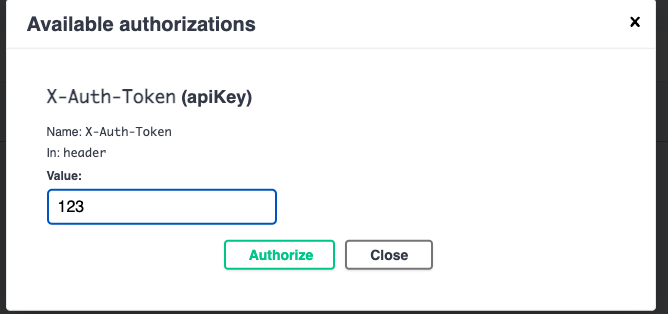
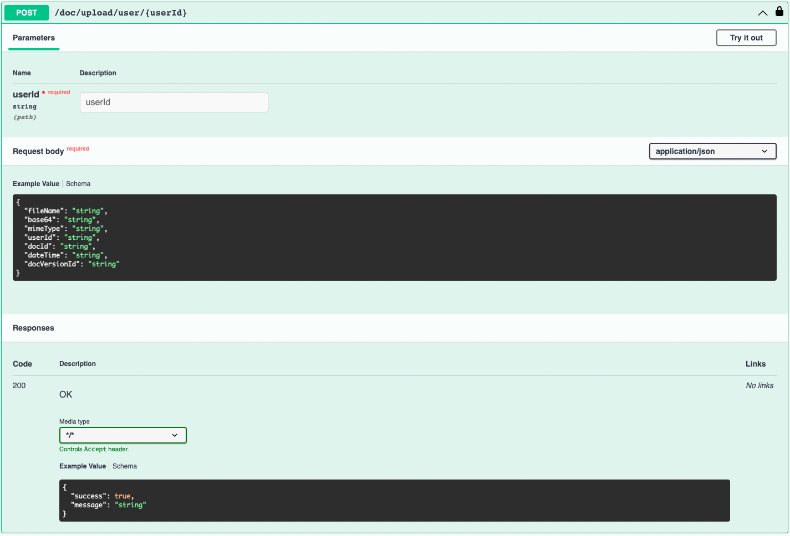
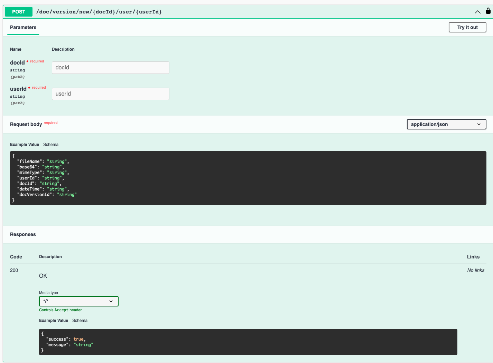

# System Kilo Doc Rest

This application serves as the restful services as part of the overall https://github.com/jvalentino/sys-kilo project as they relate to documents. For system level details, please see that location.

Prerequisites

- Java
- IntelliJ
- Docker
- Docker Compose
- Git
- Minikube
- Helm
- Cassandra (for cqlsh)
- DbViz
- Kafka IDE

All of these you can get in one command using this installation automation (if you are on a Mac): https://github.com/jvalentino/setup-automation

# Contents

- [Summary](#summary)
  * [Database](#database)
  * [IDE Testing](#ide-testing)
  * [Runtime](#runtime)
  * [Verification](#verification)
  * [Strategy](#strategy)
  * [Build](#build)
- [Dev](#dev)
  * [Prometheus](#prometheus)
    + [build.gradle](#buildgradle)
    + [application.properties](#applicationproperties)
    + [SpringWebConfig](#springwebconfig)
    + [WebSecurityConfig](#websecurityconfig)
  * [Docker](#docker)
    + [build-docker.sh](#build-dockersh)
    + [Dockerfile](#dockerfile)
    + [fluentbit.conf](#fluentbitconf)
    + [start.sh](#startsh)
  * [OpenAPI](#openapi)
    + [build.gradle](#buildgradle-1)
    + [SpringWebConfig](#springwebconfig-1)
    + [application.properties](#applicationproperties-1)
    + [UI](#ui)
  * [Resilience4j](#resilience4j)
    + [build.gradle](#buildgradle-2)
    + [DocRest (Controller)](#docrest-controller)
    + [application.yml](#applicationyml)
    + [/actuator/health](#actuatorhealth)
  * [API Key Security](#api-key-security)
    + [SwaggerConfiguration](#swaggerconfiguration)
    + [SecurityFilter](#securityfilter)
    + [application.properties](#applicationproperties-2)

# Summary

## Infrastructure

You launch the database container by running:

```
docker compose up -d
```

This sill executes the container in detached mode, and leave it running in the background.

You then have to create the Kafka topic:

```bash
./create-topics.sh
```


## IDE Testing

This imports as a standard Gradle project, in which you are able to easily execute tests:

[](https://github.com/jvalentino/sys-alpha-bravo/blob/main/wiki/testing.png)

## Runtime

You can run the main class as a Spring Boot application:


## Verification

[](https://github.com/jvalentino/sys-alpha-bravo/blob/main/wiki/ide_check.png)

Running check will execute both testing and static code analysis via the build.

This is otherwise the same as doing this at the command-line: `./gradlew check`

## Strategy

Codenarc is used to ensure that no common coding issues can be added.

Jacoco is used to enforce that line coverage is over 85%.

Tests that end in "IntgTest" are used for integration testing via Spring Boot Test, otherwise they are unit tests.

Every code commit triggers a Github Action pipeline that runs the entire build process.

## Build

The following builds the executable jar file:

```bash
./gradlew build
```

...and then the following builds and publishing locally the docker image:

```bash
./build-docker.sh
```


## Deploy

The following deploys the docker image to Kubernetes via Helm:

```bash
./deploy.sh
```

If it worked you can access it via http://localhost:8080/swagger-ui/index.html

# Dev

## Runtime Validation

It is then recommended you run thus application on port 8080, which can be done in two ways:

**IDE**


**Command-Line**

```bash
java -jar --server.port=8080 build/libs/sys-kilo-doc-rest-0.0.1.jar
```

### Swagger UI

The Swagger UI can then be accessed via http://localhost:8080/swagger-ui/index.html


You are then going to want to set the authorization code to `123`, otherwise access will be defined. That is our default/testing API Key.




### /doc/versions/{docId}

Used for listing the versions of a specific document.


### /doc/version/download/{docVersionId}

Used for downloading a specific document version.


### /doc/all

User for listing al documents.


### /doc/upload/user/{userId}

Used for uploading a new document, where that given document becomes the first version of it. The input is a file name and then a byte array: src/test/resources/doc-dto.json



### /doc/version/new/{docId}/user/{userId}

This uploads a new version to an existing document. The input is a file name and then a byte array: src/test/resources/doc-dto.json



### /doc/populate

Due to the actual data population happening in a different application entirely, I added this endpoint to automatically populate the database with a document and two versions:


## Prometheus

Getting Prometheus to work required the following steps:

### build.gradle

```groovy
// monitoring
	implementation 'org.springframework.boot:spring-boot-starter-actuator'
	implementation 'io.micrometer:micrometer-registry-prometheus'
```

### application.properties

```properties
management.endpoints.web.exposure.include=health, metrics, prometheus
```

### SpringWebConfig

```groovy
@Override
    void configureMessageConverters(List<HttpMessageConverter<?>> converters) {
        converters.add(new MappingJackson2HttpMessageConverter(jsonMapper()))

        // requires for prometheus endpoint
        StringHttpMessageConverter converter = new StringHttpMessageConverter()
        converter.setSupportedMediaTypes(Arrays.asList(
                MediaType.TEXT_PLAIN,
                new MediaType('application', 'openmetrics-text')))
        converters.add(converter)

        // No converter for [class java.lang.String] with preset Content-Type
        // 'application/openmetrics-text;version=1.0.0;charset=utf-8']
    }
```

## Docker

### build-docker.sh

You build the docker image by running this:

```bash
./build-docker.sh
```

This script consists of the following:

```bash
#!/bin/bash

NAME=sys-kilo-doc-rest
VERSION=latest
HELM_NAME=sys-doc-rest

helm delete $HELM_NAME || true
minikube image rm $NAME:$VERSION
rm -rf ~/.minikube/cache/images/arm64/$NAME_$VERSION || true
docker build --no-cache . -t $NAME
minikube image load $NAME:$VERSION
```

There is quite a bit of magic in here not directly relating to docker. This scripting ensures we build a clean new image, make sure to remove it if it is running in Minikube, and then load it back into the cache.

### Dockerfile

The container for running this application consists of two parts:

- Openjdk - For running the application
- Fluentbit - A log forwarder to take the log files from nginx and forward them to Elasticsearch.

```docker
FROM openjdk:11
WORKDIR .
COPY build/libs/sys-kilo-doc-rest-0.0.1.jar /usr/local/sys-kilo-doc-rest-0.0.1.jar
EXPOSE 8080
COPY config/docker/start.sh /usr/local/start.sh

# puts it in /opt/fluent-bit/bin/fluentbit
RUN curl https://raw.githubusercontent.com/fluent/fluent-bit/master/install.sh | sh
COPY config/docker/fluentbit.conf /opt/fluent-bit/bin/fluentbit.conf

RUN ["chmod", "+x", "/usr/local/start.sh"]
ENTRYPOINT ["/usr/local/start.sh"]
```

### fluentbit.conf

```properties
[INPUT]
    name              tail
    path              /usr/local/*.log
    multiline.parser docker, cri

[OUTPUT]
    Name  es
    Match *
    Host elasticsearch-master
    Port 9200
    Index sys-doc-rest
    Suppress_Type_Name On
```

This configuration picks up the custom log files, and forward them to elastic search using the index of `backend`.

### start.sh

We already have a custom script for our entry point, where we now change it to also run fluent bit in the background:

```bash
#!/bin/bash
cd /opt/fluent-bit/bin
./fluent-bit -c fluentbit.conf > fluentbit.log 2>&1 &

cd /usr/local
java -jar \
	-Dspring.data.cassandra.contact-points=cassandra \
	-Dkafka.bootstrap-servers=kafka:9092 \
	sys-kilo-doc-rest-0.0.1.jar
```

## OpenAPI

> The OpenAPI Specification, previously known as the Swagger Specification, is a specification for a machine-readable interface definition language for describing, producing, consuming and visualizing RESTful web services

- https://en.wikipedia.org/wiki/OpenAPI_Specification

The only reason this was more than once step, is because I had overridden the default JSON converter to handle hibernate entities, which messed it up for Swagger. The result was a series of workarounds.

### build.gradle

```groovy
implementation 'org.springdoc:springdoc-openapi-ui:1.6.15'
implementation 'org.springdoc:springdoc-openapi-webmvc-core:1.6.15'
implementation 'org.springdoc:springdoc-openapi-groovy:1.6.15'
```

### application.properties

```properties
springdoc.swagger-ui.url=/v3/api-docs.yaml
```

This is done to have Swagger use the YAML endpoint instead of the JSON one, because we busted the JSON endpoint with our Jackson magic.

### UI

The result of all this magic is that you can now get to http://localhost:8080/swagger-ui/index.html, and see:


## Resilience4j

> Resilience4j is a lightweight fault tolerance library designed for functional programming. Resilience4j provides higher-order functions (decorators) to enhance any functional interface, lambda expression or method reference with a Circuit Breaker, Rate Limiter, Retry or Bulkhead. You can stack more than one decorator on any functional interface, lambda expression or method reference. The advantage is that you have the choice to select the decorators you need and nothing else.

- https://resilience4j.readme.io/docs

### build.gradle

```groovy
// Circuit Breaker (Hystrix Replacement)
	implementation group: 'io.github.resilience4j', name: 'resilience4j-spring-boot2', version: '1.7.0'
```

### DocRest (Controller)

```groovy
@GetMapping('/doc/all')
    @CircuitBreaker(name = 'DocAll')
    DocListDto dashboard() {
        DocListDto dashboard = new DocListDto()
        dashboard.with {
            documents = docService.allDocs()
        }

        dashboard
    }
    
    //....
```

You want to annotate every endpoint with a name.

### application.yml

```yaml
management:
  health:
    circuitbreakers:
      enabled: 'true'
    ratelimiters:
      enabled: 'true'
  endpoints:
    web:
      exposure:
        include: '*'
  endpoint:
    health:
      show-details: always
--- More stuff...
resilience4j:
  circuitbreaker:
    instances:
      DocAll:
        registerHealthIndicator: true
        ringBufferSizeInClosedState: 5
        ringBufferSizeInHalfOpenState: 3
        waitDurationInOpenState: 10s
        failureRateThreshold: 50
        maxRetryAttempts: 3
        waitDuration: 5000
      DocUpload:
        registerHealthIndicator: true
        ringBufferSizeInClosedState: 5
        ringBufferSizeInHalfOpenState: 3
        waitDurationInOpenState: 10s
        failureRateThreshold: 50
        maxRetryAttempts: 3
        waitDuration: 5000
      DocVersions:
        registerHealthIndicator: true
        ringBufferSizeInClosedState: 5
        ringBufferSizeInHalfOpenState: 3
        waitDurationInOpenState: 10s
        failureRateThreshold: 50
        maxRetryAttempts: 3
        waitDuration: 5000
      DocDownload:
        registerHealthIndicator: true
        ringBufferSizeInClosedState: 5
        ringBufferSizeInHalfOpenState: 3
        waitDurationInOpenState: 10s
        failureRateThreshold: 50
        maxRetryAttempts: 3
        waitDuration: 5000
      DocVersionNew:
        registerHealthIndicator: true
        ringBufferSizeInClosedState: 5
        ringBufferSizeInHalfOpenState: 3
        waitDurationInOpenState: 10s
        failureRateThreshold: 50
        maxRetryAttempts: 3
        waitDuration: 5000
```

You then declare the settings for each endpoint.

### /actuator/health

```json
{
   "status":"UP",
   "components":{
      "circuitBreakers":{
         "status":"UP",
         "details":{
            "DocVersionNew":{
               "status":"UP",
               "details":{
                  "failureRate":"-1.0%",
                  "failureRateThreshold":"50.0%",
                  "slowCallRate":"-1.0%",
                  "slowCallRateThreshold":"100.0%",
                  "bufferedCalls":0,
                  "slowCalls":0,
                  "slowFailedCalls":0,
                  "failedCalls":0,
                  "notPermittedCalls":0,
                  "state":"CLOSED"
               }
            },
            "DocDownload":{
               "status":"UP",
               "details":{
                  "failureRate":"-1.0%",
                  "failureRateThreshold":"50.0%",
                  "slowCallRate":"-1.0%",
                  "slowCallRateThreshold":"100.0%",
                  "bufferedCalls":0,
                  "slowCalls":0,
                  "slowFailedCalls":0,
                  "failedCalls":0,
                  "notPermittedCalls":0,
                  "state":"CLOSED"
               }
            },
            "DocVersions":{
               "status":"UP",
               "details":{
                  "failureRate":"-1.0%",
                  "failureRateThreshold":"50.0%",
                  "slowCallRate":"-1.0%",
                  "slowCallRateThreshold":"100.0%",
                  "bufferedCalls":0,
                  "slowCalls":0,
                  "slowFailedCalls":0,
                  "failedCalls":0,
                  "notPermittedCalls":0,
                  "state":"CLOSED"
               }
            },
            "DocUpload":{
               "status":"UP",
               "details":{
                  "failureRate":"-1.0%",
                  "failureRateThreshold":"50.0%",
                  "slowCallRate":"-1.0%",
                  "slowCallRateThreshold":"100.0%",
                  "bufferedCalls":0,
                  "slowCalls":0,
                  "slowFailedCalls":0,
                  "failedCalls":0,
                  "notPermittedCalls":0,
                  "state":"CLOSED"
               }
            },
            "DocAll":{
               "status":"UP",
               "details":{
                  "failureRate":"-1.0%",
                  "failureRateThreshold":"50.0%",
                  "slowCallRate":"-1.0%",
                  "slowCallRateThreshold":"100.0%",
                  "bufferedCalls":0,
                  "slowCalls":0,
                  "slowFailedCalls":0,
                  "failedCalls":0,
                  "notPermittedCalls":0,
                  "state":"CLOSED"
               }
            }
         }
      },
      "db":{
         "status":"UP",
         "details":{
            "database":"PostgreSQL",
            "validationQuery":"isValid()"
         }
      },
      "diskSpace":{
         "status":"UP",
         "details":{
            "total":494384795648,
            "free":356838473728,
            "threshold":10485760,
            "exists":true
         }
      },
      "ping":{
         "status":"UP"
      },
      "rateLimiters":{
         "status":"UNKNOWN"
      }
   }
}
```

## API Key Security

Since this is an API intended to be called only by an authorized party, we need at least some basic security. In this case, I am using the concept of an API Key. Specifically, every request will be expected to require the HTTP Header of `X-Auth-Token` with the appropriate value, at least when calling the explicitly secure services under `/doc`.

### SwaggerConfiguration

```groovy
@Configuration
@CompileDynamic
@SuppressWarnings(['DuplicateStringLiteral'])
class SwaggerConfiguration {

    @Value('${spring.application.name}')
    String appName

    // https://stackoverflow.com/questions/63671676/
    // springdoc-openapi-ui-add-jwt-header-parameter-to-generated-swagger
    @Bean
    OpenAPI customOpenAPI() {
        new OpenAPI()
                .info(new Info().title(appName).version('1.0.0'))
                .components(new Components()
                        .addSecuritySchemes('X-Auth-Token', new SecurityScheme()
                                .type(SecurityScheme.Type.APIKEY)
                                .in(SecurityScheme.In.HEADER)
                                .name('X-Auth-Token')))
                .addSecurityItem(new SecurityRequirement().addList('X-Auth-Token'))
    }

}
```

First we have to tell Swagger to put an "Authorize" button in its user interface, that we can use to provide this X-Auth-Token with every request.


### SecurityFilter

```groovy
@Service
@Configurable
@CompileDynamic
@Slf4j
@SuppressWarnings(['UnnecessaryGetter'])
class SecurityFilter extends GenericFilterBean {

    @Value('${management.apikey}')
    String apikey

    @Value('${management.securePath}')
    String securePath

    void doFilter(
            ServletRequest request,
            ServletResponse response,
            FilterChain chain) throws IOException, ServletException {
        // pull the token out of the header
        HttpServletRequest httpRequest = (HttpServletRequest) request
        String token = httpRequest.getHeader('x-auth-token')
        String pathInfo = httpRequest.getRequestURI()

        if (!pathInfo.startsWith(securePath)) {
            log.info("${pathInfo} is not secured")
            chain.doFilter(request, response)
            return
        }

        if (token != apikey) {
            HttpServletResponse res = (HttpServletResponse) response
            res.status = 401
            return
        }

        chain.doFilter(request, response)
    }

}
```

Next we have to add an interceptor that gets called prior to every request. 

- If that request is not /doc related, we ignore security
- If that request is /doc related, we verify that it matches the expected key

### application.properties

```yaml
spring:
  application:
    name: sys-juliet-rest-doc
management:
  apikey: 123
  securePath: /doc
```

The involved properties were put in the application.properties, so that we can also change them at runtime from a deployment perspective.

## Cassandra

There are two things I gave up on, because I could not get them to work after 2 days of fighting with them:

- Cassandra Unit - I tried using the embedded server and invoking the embedded server directly, and each step would lead to more problems to be solved. Instead, I resorted to just mocking the Cassandra repository level in the integration tests.
- Liquidbase for Cassandra - I tried the Gradle Plugin, the Maven Plugin, and even resorted to using the liquibase CLI. Nothing worked, and I ended up resorting to a CQL file as a part of the database project that doesn't do stuff unless it has to.

### build.gradle

```groovy
implementation 'org.springframework.boot:spring-boot-starter-data-cassandra'
```

### CassandraConfig

```groovy
@Configuration
@EnableCassandraRepositories(basePackages = 'com.github.jvalentino.kilo.repo')
class CassandraConfig {

}
```

### application.yml

```yaml
spring:
  data:
    cassandra:
      local-datacenter: datacenter1
      port: 9042
      contact-points: localhost
      keyspace-name: examplesys
```

### Table Mappings

```groovy
@Table(value='doc')
class DocTable {

    @Id
    @PrimaryKey('doc_id')
    @PrimaryKeyColumn(name = 'doc_id', ordinal = 0, type = PrimaryKeyType.PARTITIONED)
    @Column(value = 'doc_id')
    UUID docId

    @Column
    String name

    @Column(value = 'mime_type')
    String mimeType
```

Fairly standard, except that you have to list the primary key column in 4 different ways, otherwise findById doesn't work.

### Repository Mappings

```groovy
@Repository
interface DocVersionRepo extends CassandraRepository<DocVersionTable, UUID> {

    @Query('select * from doc_version where doc_id = ?0')
    List<DocVersionTable> findByDocId(UUID docId)

}
```

Standard, except for that you have to use Native CQL instead of HQL like you wood with Hibernate.

### BaseIntg

```groovy
@EnableAutoConfiguration(exclude=[
        CassandraDataAutoConfiguration,
        CassandraAutoConfiguration
])
@ExtendWith(SpringExtension)
@SpringBootTest
@AutoConfigureMockMvc
@TestPropertySource(
        locations = "classpath:integration.properties")
abstract class BaseIntg extends Specification {
```

In order to run an integration test without it trying to connect to Cassandra, I had to disable the auto connection by excluding:

- CassandraDataAutoConfiguration
- CassandraAutoConfiguration

### DbViz


## Kafka

### build.gradle

```groovy
// Kafka
	implementation 'org.springframework.boot:spring-boot-starter'
	implementation 'org.apache.kafka:kafka-streams'
	implementation 'org.springframework.kafka:spring-kafka'

```

### application.yml

```yaml
kafka:
  bootstrap-servers: localhost:9092
  producer:
    client-id: ${spring.application.name}
    key-serializer: org.apache.kafka.common.serialization.StringSerializer
    value-serializer: org.apache.kafka.common.serialization.StringSerializer
```

### DocProducer

```groovy
@Component
class DocProducer {

    @Autowired
    KafkaTemplate<String, String> kafkaTemplate

    void produce(DocDto doc) {
        kafkaTemplate.send('doc', doc.docId, toJson(doc))
    }

    String toJson(Object obj) {
        new ObjectMapper().writeValueAsString(obj)
    }

}
```

This just injects the KafkaTemplate into a reusable components, that turns an object into JSON on the doc topic, but that also uses the ID as the key.

### Kafka IDE

This is useful for seeing what is in Kafka.


